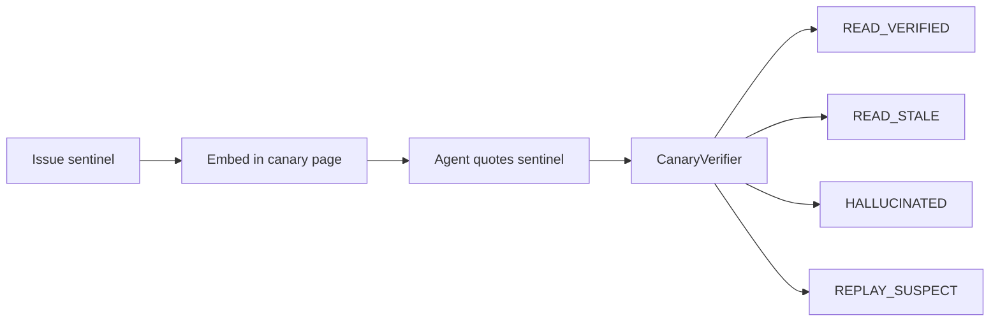
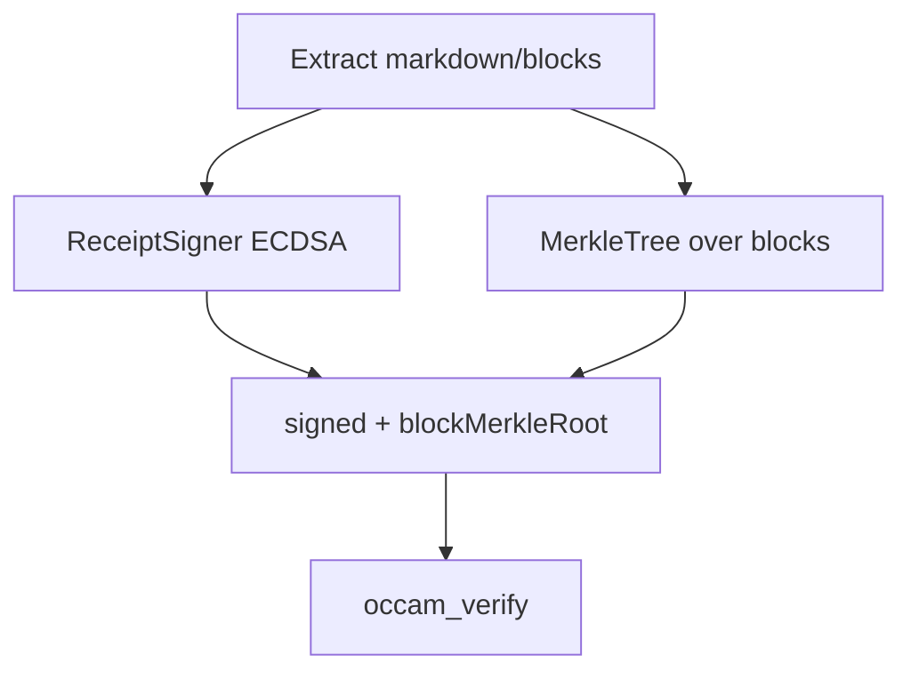
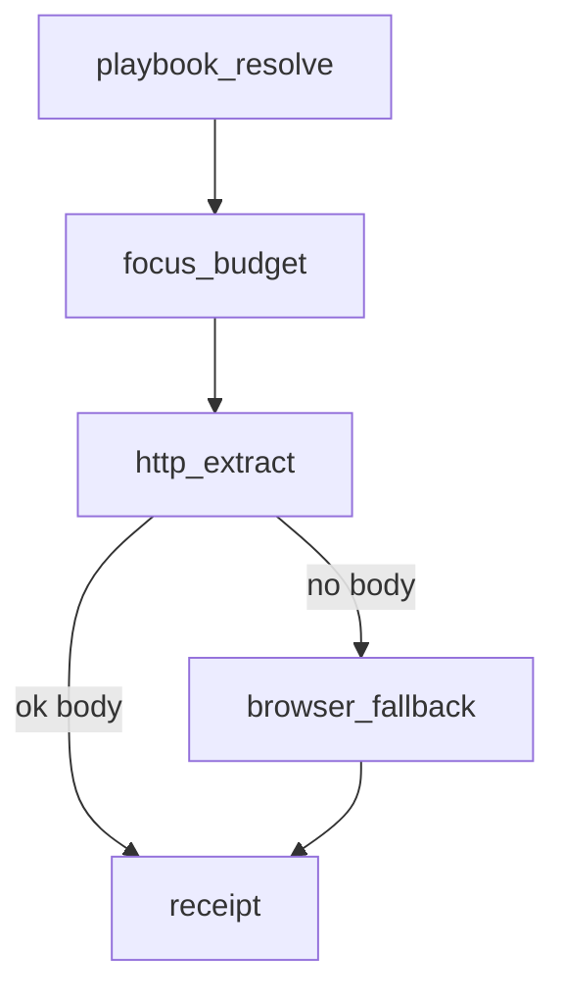

# Occam

Live URL → compact Markdown for LLM agents — or a typed `ok:false`.
Never invent page text from model memory.

**Occam** is the product name. The MCP host identifies as **`ff-occam`**
([`OccamMcpServerRegistration.cs`](src/FFOccamMcp.Core/Transport/OccamMcpServerRegistration.cs)).

[](https://github.com/ContextForgeAI/occam/releases/latest)
[](https://github.com/ContextForgeAI/occam/releases)
[](LICENSE)
[](https://www.npmjs.com/package/ff-occam)
[](src/FFOccamMcp.Core/FFOccamMcp.Core.csproj)
[](docs/tools-reference.md)

- **Proof-of-read canary** — HMAC sentinel with four verdicts:
  `READ_VERIFIED`, `READ_STALE`, `HALLUCINATED`, `REPLAY_SUSPECT`.
  **MCP + CLI** (`occam_canary_issue` / `occam_canary_verify`, plus `occam canary`).
  ([`Canary/`](src/FFOccamMcp.Core/Canary/),
  [ADR-0010](docs/adr/0010-proof-of-read-canary.md),
  [PROBE_PROTOCOL.md](PROBE_PROTOCOL.md))
- **Receipts + Merkle** — ECDSA-signed extracts; verify, claim-check, attest,
  and dataset export
  ([`Receipts/`](src/FFOccamMcp.Core/Receipts/),
  [receipts](docs/receipts.md))
- **Cascade facade `occam`** — playbook → HTTP → browser → focus → receipt
  ([`OccamCascadeTool.cs`](src/FFOccamMcp.Core/Tools/OccamCascadeTool.cs),
  [ADR-0017](docs/adr/0017-cascade-facade.md))

> **Demo asset (TODO):** `docs/assets/occam-cascade-demo.gif` —
> `occam(url)` → step log → Markdown.

Default **`OCCAM_PROFILE=reader`** exposes **11** tools. Full suite: **18** core
+ **5** opt-in ([configuration](docs/configuration.md)).

---

## What's inside

Topic hubs: [CAPABILITIES](docs/CAPABILITIES.md) · [TRUST](docs/TRUST.md) ·
[CASCADE](docs/CASCADE.md) · [SEARCH](docs/SEARCH.md)

### Trust

| Capability | Notes | Source |
|------------|-------|--------|
| Proof-of-read canary | HMAC; four verdicts; **MCP + CLI** | [`Canary/`](src/FFOccamMcp.Core/Canary/) · [TRUST](docs/TRUST.md) |
| Receipt v1 (ECDSA P-256) | On by default; `OCCAM_RECEIPTS=off` disables | [`ReceiptSigner.cs`](src/FFOccamMcp.Core/Receipts/ReceiptSigner.cs), [`ReceiptsPolicy.cs`](src/FFOccamMcp.Core/Receipts/ReceiptsPolicy.cs) |
| Merkle blocks + verify | Modes: offline, live, prove, citation, history | [`MerkleTree.cs`](src/FFOccamMcp.Core/Receipts/MerkleTree.cs), [`OccamVerifyTool.cs`](src/FFOccamMcp.Core/Tools/OccamVerifyTool.cs) |
| Claim check + attest | Retrieval is not support; fail-closed status | [`ClaimCheckService.cs`](src/FFOccamMcp.Core/Claims/ClaimCheckService.cs), [`AttestService.cs`](src/FFOccamMcp.Core/Attest/AttestService.cs) |
| Dataset export | Per-row receipt + manifest Merkle root | [`DatasetExportService.cs`](src/FFOccamMcp.Core/Dataset/DatasetExportService.cs) |

### Fetch

| Capability | Notes | Source |
|------------|-------|--------|
| Cascade `occam` | Facade stages only — not proxy or external CLI | [`CascadeService.cs`](src/FFOccamMcp.Core/Cascade/CascadeService.cs) · [CASCADE](docs/CASCADE.md) |
| Transcode / probe / digest / map | Core readers and discovery | [`Tools/`](src/FFOccamMcp.Core/Tools/) · [tools-reference](docs/tools-reference.md) |
| Router `http_then_browser` | Separate from the cascade step log | [`OccamRouter.cs`](src/FFOccamMcp.Core/Routing/OccamRouter.cs) |

### Search

| Capability | Notes | Source |
|------------|-------|--------|
| DuckDuckGo default | Keyless; HTML → lite fallback | [`DuckDuckGoSearchProvider.cs`](src/FFOccamMcp.Core/Search/DuckDuckGoSearchProvider.cs) · [SEARCH](docs/SEARCH.md) |
| Fan-out + health | `OCCAM_SEARCH_PROVIDERS` CSV | [`SearchService.cs`](src/FFOccamMcp.Core/Services/SearchService.cs), [`SearchProviderHealth.cs`](src/FFOccamMcp.Core/Search/SearchProviderHealth.cs) |
| Other providers | searxng, brave, tavily; **external CLI search provider (opt-in, not bundled)** | [SEARCH](docs/SEARCH.md) |

### Playbooks

Resolve, heal, lint, and save —
[`PlaybookSeedResolver.cs`](src/FFOccamMcp.Core/Playbooks/PlaybookSeedResolver.cs),
[`PlaybookHealService.cs`](src/FFOccamMcp.Core/Playbooks/PlaybookHealService.cs),
[`PlaybookLinter.cs`](src/FFOccamMcp.Core/Playbooks/PlaybookLinter.cs),
[`PlaybookSaveService.cs`](src/FFOccamMcp.Core/Playbooks/PlaybookSaveService.cs)
· [playbooks](docs/playbooks.md)

### Infrastructure

| Capability | Notes | Source |
|------------|-------|--------|
| Proxy + round-robin rotation | `OCCAM_PROXY_LIST` / `OCCAM_PROXY_LIST_FILE` | [`RoundRobinProxyRotationService.cs`](src/FFOccamMcp.Core/Services/RoundRobinProxyRotationService.cs) |
| Browser pool / Playwright | Daemon by default | [`Workers/`](src/FFOccamMcp.Core/Workers/) · [configuration](docs/configuration.md) |
| Tool profiles | `minimal`, `basic`, `reader`, `full` | [`OccamToolProfile.cs`](src/FFOccamMcp.Core/Transport/OccamToolProfile.cs) |

Browser fingerprint rotation is **not implemented**.

---

## Unique algorithms

Deep hubs: [TRUST](docs/TRUST.md) · [CASCADE](docs/CASCADE.md) · [SEARCH](docs/SEARCH.md)

### 1. Proof-of-read (HMAC canary)

A process secret derives an HMAC-SHA256 sentinel per `(session, time bucket)`.
The agent must quote it. The verifier returns one of four exclusive verdicts
([`CanarySecret.cs`](src/FFOccamMcp.Core/Canary/CanarySecret.cs),
[`CanaryVerifier.cs`](src/FFOccamMcp.Core/Canary/CanaryVerifier.cs),
[`CanaryModels.cs`](src/FFOccamMcp.Core/Canary/CanaryModels.cs)).

**Surface:** MCP tools `occam_canary_issue` / `occam_canary_verify` (reader + full
profiles), plus CLI `occam canary` and the probe HTTP host
([`OccamCanaryIssueTool.cs`](src/FFOccamMcp.Core/Tools/OccamCanaryIssueTool.cs),
[`CanaryCliVerbs.cs`](src/FFOccamMcp.Core/Canary/CanaryCliVerbs.cs),
[`CanaryProbeServerHost.cs`](src/FFOccamMcp.Core/Canary/CanaryProbeServerHost.cs)).

[ADR-0010](docs/adr/0010-proof-of-read-canary.md) · [PROBE_PROTOCOL.md](PROBE_PROTOCOL.md)

> **Demo asset (TODO):** `docs/assets/occam-canary-demo.gif` —
> issue → quote → `READ_VERIFIED` vs `HALLUCINATED` (MCP + CLI).



### 2. Receipts + Merkle + capsule

ECDSA P-256 signed extraction envelope; ordered SHA-256 Merkle over blocks;
`occam_verify` modes offline / live / prove / citation / history; optional
`occam://capsule/…`
([`ReceiptSigner.cs`](src/FFOccamMcp.Core/Receipts/ReceiptSigner.cs),
[`MerkleTree.cs`](src/FFOccamMcp.Core/Receipts/MerkleTree.cs),
[`CapsuleCodec.cs`](src/FFOccamMcp.Core/Receipts/CapsuleCodec.cs),
[`OccamVerifyTool.cs`](src/FFOccamMcp.Core/Tools/OccamVerifyTool.cs)).

Integrity relative to a key is **not** truth.
Details: [receipts](docs/receipts.md),
[receipt verification](docs/receipt_verification.md).



### 3. Capability exam (**beta** — CLI, not auto MCP)

Four one-point tasks (Canary, BasicCall, FocusBudget, Chain) score 0–4, map to
tier Weak / Medium / Strong, and recommend `OCCAM_PROFILE`
`minimal` / `basic` / `full`
([`ExamTasks.cs`](src/FFOccamMcp.Core/Exam/ExamTasks.cs),
[`ExamGrader.cs`](src/FFOccamMcp.Core/Exam/ExamGrader.cs),
[`ExamScoring.cs`](src/FFOccamMcp.Core/Exam/ExamScoring.cs)).

This is **not** auto-adaptive MCP. The operator applies the result by setting
`OCCAM_PROFILE`
([`ExamGradeCli.cs`](src/FFOccamMcp.Core/Exam/ExamGradeCli.cs),
[ADR-0016](docs/adr/0016-capability-exam.md)).

```
score 0–1 → Weak   → OCCAM_PROFILE=minimal (1 tool)
score 2–3 → Medium → OCCAM_PROFILE=basic   (3 tools)
score 4   → Strong → OCCAM_PROFILE=full    (16 core)
```

### 4. Cascade facade

Tool `occam` runs: `playbook_resolve` → `focus_budget` → `http_extract` →
`browser_fallback` → `receipt`
([`CascadeModels.cs`](src/FFOccamMcp.Core/Cascade/CascadeModels.cs),
[`CascadeService.cs`](src/FFOccamMcp.Core/Cascade/CascadeService.cs)).
Step statuses: ok, skipped, omitted, failed, degraded.

Proxy and external CLIs are **not** cascade stages
([CASCADE](docs/CASCADE.md), [ADR-0017](docs/adr/0017-cascade-facade.md)).



### 5. Fan-out search

Default keyless DuckDuckGo. Optional `OCCAM_SEARCH_PROVIDERS` CSV fan-out with
health, degrade, and rate limits
([`SearchService.cs`](src/FFOccamMcp.Core/Services/SearchService.cs),
[`SearchProviderHealth.cs`](src/FFOccamMcp.Core/Search/SearchProviderHealth.cs)).
See [SEARCH](docs/SEARCH.md).

---

## MCP map

| Profile | Tools | Use |
|---------|------:|-----|
| `minimal` | 1 | Exam Weak — only `occam` |
| `basic` | 3 | Exam Medium — `occam`, `occam_digest`, `occam_search` |
| `reader` (default) | 9 | Day-to-day reads |
| `full` | 16 core | Full core catalog |

Exam recommends a profile; apply it with `OCCAM_PROFILE`. There is no automatic
gating
([`OccamToolProfile.cs`](src/FFOccamMcp.Core/Transport/OccamToolProfile.cs),
[`ExamScoring.cs`](src/FFOccamMcp.Core/Exam/ExamScoring.cs)).

### 18 core tools

| Tool | Role |
|------|------|
| `occam_client_capabilities` | Declare LLM context budget |
| `occam` | Cascade page read |
| `occam_transcode` | Full opt-in page reader |
| `occam_probe` | Cheap pre-fetch check |
| `occam_digest` | Several URLs at once |
| `occam_playbook_resolve` | Look up site recipe |
| `occam_map` | Same-domain link discovery |
| `occam_playbook_heal` | DOM skeleton draft recipe |
| `occam_playbook_save` | Save local playbook |
| `occam_extract_knowledge` | Typed fields via schema |
| `occam_search` | Open-web search → URLs |
| `occam_verify` | Verify or cite a receipt |
| `occam_claim_check` | Does this page back a claim? |
| `occam_attest` | Fail-closed citation status |
| `occam_playbook_lint` | Static playbook lint |
| `occam_dataset_export` | Signed multi-URL dataset |
| `occam_canary_issue` | Issue proof-of-read canary URL |
| `occam_canary_verify` | Verify canary sentinel / verdict |

Registry: [`OccamMcpServerRegistration.cs`](src/FFOccamMcp.Core/Transport/OccamMcpServerRegistration.cs).
Schemas: [tools-reference](docs/tools-reference.md).

### Opt-in tools (off by default)

| Tool(s) | Enable | Notes |
|---------|--------|-------|
| `occam_batch_submit` / `_status` / `_results` | `OCCAM_BATCH_MCP=1` | Async batch |
| `occam_watch` | `OCCAM_WATCH_MCP=1` | Stateful change watch |
| `occam_crosscheck` | `OCCAM_CONSENSUS_MCP=1` | Multi-vantage compare |
| `occam_failure_atlas` | `OCCAM_ATLAS_MCP=1` | Per-host failure atlas |
| `occam_browser_interact` | `OCCAM_BROWSER_ACTIONS_MCP=1` | Declarative browser actions |

Registration gate:
[`OccamMcpServerRegistration.cs`](src/FFOccamMcp.Core/Transport/OccamMcpServerRegistration.cs).
Limits and honesty: [experimental](docs/experimental.md).

**Canary** is in the core catalog: `occam_canary_issue` + `occam_canary_verify`
(reader + full; not on `minimal` / `basic`).

---

## Configuration

Canonical catalog: **[docs/configuration.md](docs/configuration.md)**.

| Group | Variables |
|-------|-----------|
| Core | `OCCAM_HOME`, `OCCAM_PROFILE` |
| Search | `OCCAM_SEARCH_PROVIDER`, `OCCAM_SEARCH_PROVIDERS`, `OCCAM_SEARCH_URL`, `OCCAM_SEARCH_API_KEY` |
| Proxy | `OCCAM_HTTP_PROXY`, `OCCAM_HTTPS_PROXY`, `OCCAM_NO_PROXY`, `OCCAM_PROXY_LIST`, `OCCAM_PROXY_LIST_FILE` |
| Canary | `OCCAM_CANARY_*` |
| Receipts | `OCCAM_RECEIPTS`, `OCCAM_KEYS_ROOT` |
| Opt-in MCP | `OCCAM_BATCH_MCP`, `OCCAM_WATCH_MCP`, `OCCAM_CONSENSUS_MCP`, `OCCAM_ATLAS_MCP`, `OCCAM_BROWSER_ACTIONS_MCP` |

**Advanced (optional):** `OCCAM_EXTERNAL_SEARCH_PATH`, `OCCAM_PDF_OCR*`, `OCCAM_TRANSLATE_*`
— not the default product surface
([configuration](docs/configuration.md), [SEARCH](docs/SEARCH.md)).

There is **no** shipped `occam.config.json` schema. Configure via environment
variables. An invalid `OCCAM_PROFILE` prints a `[occam.config]` warning on stderr
only.

---

## Install

Signed GitHub Release bootstrap is the recommended path.
[INSTALL.md](INSTALL.md) · [getting-started](docs/getting-started.md) ·
[quick-start](docs/quick-start.md)

<details>
<summary>Windows</summary>

```powershell
irm https://raw.githubusercontent.com/ContextForgeAI/occam/main/scripts/get-ff-occam.ps1 | iex
```

</details>

<details>
<summary>Linux x64 / macOS Apple Silicon</summary>

```bash
curl -fsSL https://raw.githubusercontent.com/ContextForgeAI/occam/main/scripts/get-ff-occam.sh | bash
```

</details>

| Channel | What you get | Status |
|---------|--------------|--------|
| GitHub Release bootstrap | Host + `occam` CLI + Cosign verify | **Recommended (GA host 1.2.0)** |
| `npx ff-occam@1.2.0` | MCP host only — no `connect` / `doctor` | Experimental |

Docs hub: [docs/index.md](docs/index.md) · Agent entry: [AGENTS.md](AGENTS.md) ·
API: [MCP_API_SPEC.md](MCP_API_SPEC.md) · Agent doc map: [`llms.txt`](llms.txt)
