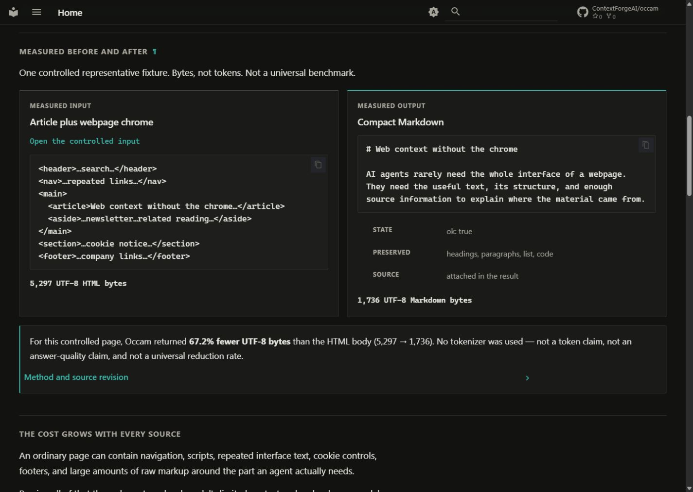

# FF-Occam

**Live web → compact, source-linked, verifiable context for AI agents.**

Occam reads current web pages on your machine, removes interface noise, fits
the useful content to an agent's context window, and returns either clean
Markdown or an explicit reason why the content is unknown.

[](https://github.com/ContextForgeAI/occam/actions/workflows/ci.yml)
[](https://www.npmjs.com/package/ff-occam)
[](LICENSE)

```bash
npm install -g ff-occam@1.0.0-rc.4
occam connect
```

Then open a new conversation in your MCP client:

```text
Use Occam to read https://example.com/ and tell me what it says.
Include the source. If the read fails, report the reason instead of guessing.
```

> Current release: **1.0.0-rc.4**. npm is the fastest RC trial path. The
> production-oriented path uses a signed release bootstrap; see
> [Install safely](#install-safely).



## Three jobs

| Need | Use Occam to | Start with |
|------|--------------|------------|
| **Read** | Turn one live URL into clean Markdown | `occam_transcode(url)` |
| **Research** | Focus and combine several known sources | `occam_digest(urls, focus_query)` |
| **Verify** | Check extract integrity and portable citation proofs | `occam_verify(receipt, markdown)` |

Open-web discovery is available through `occam_search` when a search provider
is configured. Occam does not pretend an unconfigured search backend exists.

## Why not a generic fetch?

| Generic fetch | FF-Occam |
|---------------|----------|
| Raw HTML, page chrome, or a silent empty shell | Compact Markdown or typed `ok:false` |
| Output can consume the whole context window | Explicit budget, focus, sections, and deltas |
| One acquisition method | HTTP → browser → disclosed public/managed adapters |
| No evidence for later citation checks | Optional signed receipt and block proofs |
| Missing content invites a model-memory guess | `ok:false` means **unknown** |

## Measured on the same live corpus

One pinned [WRB](https://github.com/dondai44423/wrb) run on 2026-08-30, same
machine and network. These are live observations, not universal success claims.

| Fetch metric | FF-Occam | DonSeTch 3.4.2 |
|--------------|---------:|---------------:|
| Tier 1 retrieval | 100.0% | 100.0% |
| Tier 2 retrieval | 75.0% | 75.0% |
| Tier 3 retrieval | 38.5% | 53.8% |
| Overall retrieval | 75.0% (36/48) | 79.2% (38/48) |
| False-positive rate | 0.0% | 0.0% |
| Successful fetch p50 | 630 ms | 708 ms |
| Successful fetch p90 | 1,973 ms | 969 ms |

Method, pinned revision, runner, limitations, and reproduction commands:
[`scripts/bench/README.md`](scripts/bench/README.md). WRB was created by the
DonSeTch author; treat it as reproducible comparative evidence, not independent
certification.

---

## Install safely

For production-oriented installs, use the signed GitHub Release bootstrap:

```bash
# Linux x64 / macOS Apple Silicon
curl -fsSL https://raw.githubusercontent.com/ContextForgeAI/occam/main/scripts/get-ff-occam.sh | bash
```

```powershell
# Windows x64
irm https://raw.githubusercontent.com/ContextForgeAI/occam/main/scripts/get-ff-occam.ps1 | iex
```

Published RIDs: `win-x64`, `linux-x64`, `osx-arm64`. The bootstrap verifies
the archive binding and required Cosign bundle before installing. Details:
[INSTALL.md](INSTALL.md) ·
[installation safety](docs/trust/installation-safety.md).

---

## Use it

### MCP (AI agents — Cursor, Claude, Hermes, …)

After `occam connect`, Cursor, Claude, Hermes, and other MCP clients can call
Occam. The default `reader` profile exposes the everyday reading tools; use
`full` only for playbook authoring and advanced evidence workflows.

Agent map: [`llms.txt`](llms.txt) → start with [Why Occam](docs/why-occam.md).

### CLI (humans / scripts)

```bash
occam doctor          # runtime health
occam connect         # wire a supported MCP host
occam --help
```

Ad-hoc extract from a checkout (dev):

```bash
dotnet run --project benchmarks/l0-gate -- --url=https://example.com
```

---

## Tools by task

| Goal | Tool |
|------|------|
| Size later reads to your model window | `occam_client_capabilities` |
| Is this URL worth fetching? | `occam_probe` |
| Read **one** page | `occam_transcode` |
| Read **several** URLs | `occam_digest` (not N× transcode) |
| List site links | `occam_map` |
| Search the open web | `occam_search` (needs `OCCAM_SEARCH_PROVIDER`) |
| Typed fields from a playbook | `occam_extract_knowledge` |
| Prove a receipt / check a claim | `occam_verify` · `occam_claim_check` · `occam_attest` |

Opt-in (env-gated): batch, watch, crosscheck, failure atlas, browser interact — [experimental](docs/experimental.md).

---

## Spend fewer context tokens

Live output is Markdown, not an opaque summary. Shape it with:

| Knob | Effect |
|------|--------|
| `occam_client_capabilities(context_tokens=…)` | Ambient ~20% output budget |
| `max_tokens` / `fit_markdown` + `focus_query` | Cap / BM25 prune |
| `compact_links` / `include_media_refs` | Less link/media noise |
| `json_blocks` + `rank_blocks` | Citation spans + salience |
| `if_none_match` / `diff_against` | Skip unchanged / send deltas |

---

## Inspect the controlled demo

The hero image uses one inspectable fixture: 5,297 UTF-8 HTML bytes become
1,736 Markdown bytes while preserving the article structure. This is a
reproducible example, not an average reduction or token claim.

[Input](https://contextforgeai.github.io/occam/examples/current-proof/representative-input.html) · [Output](docs/examples/current-proof/representative-output.md) · [Method](docs/examples/current-proof/representative-measurement.json)

---

## Trust limits (do not overclaim)

| Claim | Reality |
|-------|---------|
| `ok:false` | Content **unknown** — never substitute training memory |
| Receipts | Integrity **relative to a key** — not truth / identity / trusted time |
| Crosscheck | Comparison — **not** consensus proof |
| npm | Experimental RC — **not** GA |
| Cosign | Release authenticity under policy — **not** page-content truth |
| CAPTCHA | Detected — **not** solved |

[Trust & Safety](docs/trust-and-safety.md)

---

## Go deeper

| Link | For |
|------|-----|
| [Why Occam](docs/why-occam.md) | Advantages + every common knob |
| [Documentation hub](docs/index.md) | Site entry / landing |
| [Quick Start](docs/quick-start.md) | Install → connect → first read |
| [Choosing a tool](docs/choosing-a-tool.md) | Task → tool table |
| [Tools reference](docs/tools-reference.md) | Compact param tables |
| [MCP API](MCP_API_SPEC.md) | Normative response contract |
| [Configuration](docs/configuration.md) | Env vars |
| [Troubleshooting](docs/troubleshooting.md) | Symptom → fix |
| [AGENTS.md](AGENTS.md) | Contributor / agent repo rules |

License: [AGPL-3.0-or-later](LICENSE).
