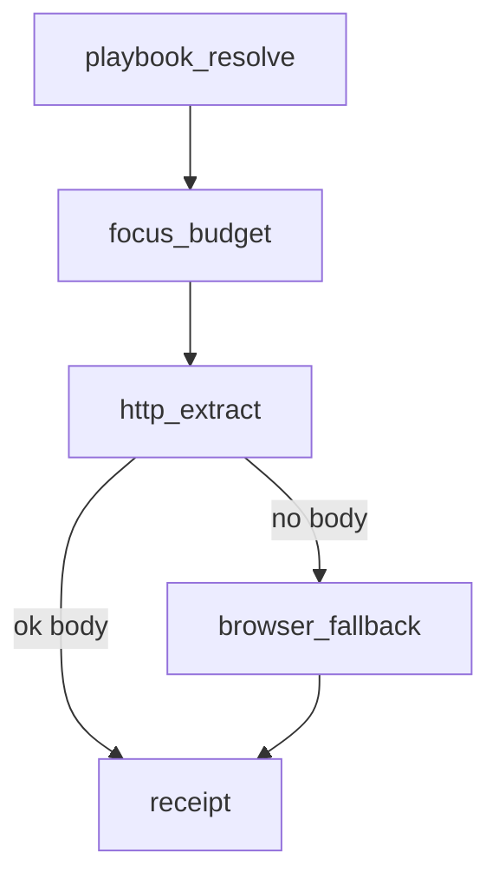

# Cascade

Hub for the progressive-disclosure read path and how it relates to profiles.
Deep contract: [ADR-0017](adr/0017-cascade-facade.md).
Related: [CAPABILITIES](CAPABILITIES.md) · [TRUST](TRUST.md) · [acquisition](acquisition.md).

## Cascade facade (`occam`)

MCP tool `occam` runs an ordered ladder and returns a step log
(`Tools/OccamCascadeTool.cs:15–25`, `Cascade/CascadeService.cs`).

| Order | Stage (wire) | Code | Notes |
|------:|--------------|------|-------|
| 1 | `playbook_resolve` | `CascadeService.cs:119+` | Always attempted; may omit on timeout |
| 2 | `focus_budget` | `:173+` | Skipped when no `task` / `budget` |
| 3 | `http_extract` | `:212–245` | HTTP extract |
| 4 | `browser_fallback` | `:247–296` | Only if HTTP produced no body; else `skipped` (`http_succeeded`) |
| 5 | `receipt` | `:298+` | Skipped when receipts disabled |

Kinds / statuses: `Cascade/CascadeModels.cs:4–30`
(`ok`, `skipped`, `omitted`, `failed`, `degraded`).

### Not cascade stages

| Concern | Where it lives | Why separate |
|---------|----------------|--------------|
| Static / rotating proxy | `Workers/EgressProxyConfig.cs`, `RoundRobinProxyRotationService.cs` | Applied on worker spawn, not a `CascadeStepKind` |
| External CLI (External CLI, OCR helpers) | `External/ExternalCli.cs` | Optional binaries; not fetch ladder steps |

Do not draw proxy or external as cascade stages in diagrams or agent prompts.

## Cascade vs Router

| Path | Mechanism | Code |
|------|-----------|------|
| Facade tool `occam` | Explicit stages + step log | `CascadeService.cs` |
| `occam_transcode` / digest / … with `backend_policy=http_then_browser` | Router HTTP→browser escalate | `Routing/OccamRouter.cs:33+` |

Same backends; different surfaces. Prefer `occam` for progressive disclosure;
use `occam_transcode` when you need the full opt-in parameter set
([tools/occam_transcode](tools/occam_transcode.md)).

## Capability exam → profile (**beta**)

Exam is a **CLI** grader (`Exam/ExamCliVerbs.cs`, `ExamGradeCli.cs`), not an
MCP tool and not an automatic profile switch.

| Score | Tier | Recommended `OCCAM_PROFILE` | Tools |
|------:|------|-------------------------------|------:|
| 0–1 | Weak | `minimal` | 1 |
| 2–3 | Medium | `basic` | 3 |
| 4 | Strong | `full` | 16 core |

Source: `Exam/ExamScoring.cs:33–51`, `ExamCliVerbs.cs:153–156`.
Tasks: Canary, BasicCall, FocusBudget, Chain (`ExamTasks.cs`).
ADR: [0016-capability-exam](adr/0016-capability-exam.md).

**Operator applies the result** by setting `OCCAM_PROFILE`. There is no
“auto-adaptive MCP” runtime.

Documented profiles for this hub: `minimal` / `basic` / `reader` / `full`
(`Transport/OccamToolProfile.cs`). Default process profile without exam:
`reader` (11 tools).

## Related

- Tool page: [tools/occam.md](tools/occam.md)
- Handbook: [04 request path](handbook/04-request-path.md),
  [05 acquisition ladder](handbook/05-acquisition-ladder.md)
- [configuration.md](configuration.md) — `OCCAM_PROFILE`
