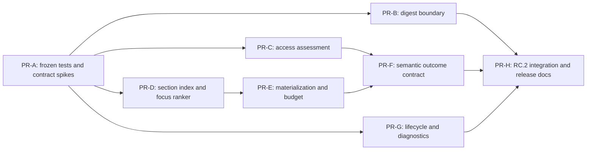

# RC.2 implementation plan

**Status:** proposed PR sequence
**Architecture:** [RC.2 solution design](RC2_SOLUTION_DESIGN.md)

No PR below should mix unrelated cleanup. Every behavior PR updates `MCP_API_SPEC.md`, generated/public
tool references, configuration guidance, and `CHANGELOG.md` as required by `AGENTS.md` in the same change.

## Dependency map

PR-C and PR-D can proceed in parallel after PR-A. PR-G is operationally independent. PR-E follows the
new focus representation so body protection is not reimplemented twice.

## PR-A — freeze evidence and prove contracts

**Goal:** turn the RC.1 evidence into deterministic failing tests and answer the two unknown framework
questions before production behavior changes.

- Add offline fixtures for D9, D10, D11, D12, D15, D16, D19 and real login controls.
- Add an SDK spike asserting the actual `tools/list` schema and handler behavior for array/string unions.
- Add a worker-to-Core DOM signal serialization/AOT spike.
- Instrument test-only ranking and budget-stage diagnostics; do not change public behavior.
- Correct evidence metadata so D10 RFC material is labeled D15 and the checksum manifest path is explicit.

**Verification:** unit/contract tests, fixture replay on Windows/Linux, Release AOT publish, existing L0
fast and full gates.
**Risk:** tests accidentally encode host-specific HTML rather than semantic assertions.
**Rollback:** revert test fixtures/spikes only.
**Done when:** every claimed defect has one deterministic red test, the union schema choice is proven,
and no live URL is required for the blocking suite.

## PR-B — digest MCP boundary

**Goal:** accept native arrays and legacy strings while guaranteeing typed validation failures.

- Change only the `occam_digest` boundary type/schema and introduce `DigestInputNormalizer`.
- Preserve URL order, limits, deduplication policy, and existing service behavior.
- Map wrong JSON types, mixed arrays, empty input, and limit violations to `invalid_arguments`.
- Update public schema snapshots and examples for both accepted forms.

**Likely area:** `OccamDigestTool`, `DigestUrlParser` or its replacement, transport registration, JSON
source generation, public contract tests, API/tool docs.
**Verification:** native array, JSON-string array, newline string, malformed/mixed arrays, oversized input,
all platforms/AOT, existing digest corpus.
**Risk:** SDK schema differs from runtime binder or clients mishandle `oneOf`.
**Rollback:** restore the string adapter; retain tests documenting the deferred limitation.
**Done when:** no user-controlled input shape escapes as framework prose and `tools/list` is truthful.

## PR-C — shared access assessment

**Goal:** remove phrase-based hard login decisions and make probe/transcode agree on shared evidence.

- Add `AccessEvidence`, `AccessAssessment`, stable evidence codes, and a pure classifier.
- Extend worker results with bounded DOM access signals.
- Adapt probe, prefetch routing, and `RequiresLoginPostProcessor` to the same assessment.
- Retire content phrase authority; retain route/status/DOM signals and an `unknown` state.
- Redact all diagnostics and preserve conservative session advice only for `login_likely`.

**Likely area:** probe classifier/service, `LoginWallDetector`, post-processors, worker result models,
router decisions, source-generated JSON, failure/API docs.
**Verification:** public authentication prose has zero hard failures; real login fixtures remain detected;
probe/transcode disposition parity; adversarial forms; no secrets in snapshots/logs; latency allocation.
**Risk:** false negatives on nonstandard identity walls.
**Rollback:** revert shared consumer wiring as one PR; do not restore host exemptions.
**Done when:** no text-only evidence produces `requires_login` and all hard decisions contain direct
evidence codes.

## PR-D — section index, query analysis, and fragments

**Goal:** select the answer-bearing section rather than the first lexical mention.

- Preserve reliable anchors and section/block spans in canonical IR.
- Add technical-token-aware query analysis and fragment normalization.
- Add deterministic rarity/coverage/proximity scoring and TOC penalties.
- Return candidate reason codes and `FocusAssessment` internally.
- Route original URL fragments as intent without sending them in the HTTP request.

**Likely area:** worker extraction DTOs, canonical document models, `FocusMatcher`, `TokenBudget` section
selection, pipeline URL handling, JSON source generation.
**Verification:** exact answer needles for RFC 401, nginx, Python, WHATWG, MDN, and GitHub docs; polluted
queries; unresolved/encoded fragments; same-score determinism; large-document CPU/memory.
**Risk:** ranking regressions on weak natural-language queries or malformed headings.
**Rollback:** keep the index adapter and restore legacy ranker behind an internal seam only during PR
review; remove the fallback before RC.2 acceptance.
**Done when:** frozen exact-section cases pass without host rules or enlarged defaults.

## PR-E — public budget inventory and answer preservation

**Goal:** allocate tokens only to serialized fields and preserve a minimum answer unit.

- Build public projection before response-budget allocation.
- Charge blocks/tables/media/receipts only when serialized.
- Make materialization protect heading plus minimum body/list/table evidence.
- Add final projected serialization estimate and explicit incomplete metadata.
- Remove the unobservable `focus_window` → `head_safe` semantic downgrade.

**Likely area:** `BudgetOwnership`, response budget planner, `MaterializationPlanner`, `TokenBudget`,
`FitMarkdown`, `TranscodePipeline`, compile/receipt models.
**Verification:** D10 at constrained budgets, nginx 4k/12k, every optional-sidecar combination, hard budget
property tests, estimator calibration, receipt verification, no-focus regressions.
**Risk:** central-path regressions, receipt incompatibility, or increased Markdown starving requested
structured fields.
**Rollback:** first revert answer-unit policy while retaining the objectively correct public inventory;
revert inventory only if a contract test proves incompatibility.
**Done when:** hidden fields consume zero public allocation and every focus loss is explicit.

## PR-F — dimensioned semantic outcomes

**Goal:** stop agents from treating transport, relevance, usability, and verdict as one boolean.

- Add dimensioned access/focus/completeness/recovery fields.
- Populate `transportOk`, `usable`, `failureCode`, and `escalationReason` per backend attempt.
- Add retrieval/verdict distinction to claim workflows.
- Derive agent hints from structured outcomes.
- Document old aliases, unchanged meanings, and removal schedule.

**Verification:** D16 recovery semantics, D13 contradicted claim, D10 focus incompleteness, all response
schema snapshots, old-client compatibility, agent-hint golden tests.
**Risk:** payload growth and clients preferring legacy aliases indefinitely.
**Rollback:** additive fields can be removed without changing old fields; retain docs warning until fixed.
**Done when:** an agent can decide retry/session/trust from fields without interpreting generic `ok` or
`found`.

## PR-G — launcher lifecycle and instance diagnostics

**Goal:** make process ownership observable and shutdown targeted.

- Add explicit signal forwarding and bounded child shutdown to the Node launcher.
- Correct/remove the parent-side `prctl` child-protection assumption.
- Expose a read-only instance descriptor in doctor/control diagnostics.
- Add exact-instance stop/refresh and overlap warnings; never kill by process name alone.
- Document Hermes as one client integration, contingent on a confirmed lifecycle API.

**Verification:** Windows job object, Linux signals/process groups, macOS process groups, parent crash,
normal exit, two valid simultaneous profiles, stale dashboard/gateway reproduction, paths with spaces.
**Risk:** signal races or terminating the wrong instance.
**Rollback:** revert control mutations first; keep read-only identity diagnostics.
**Done when:** every test child exits or is reported with an exact owner, and multi-profile operation is
preserved.

## PR-H — integration, soak, and release documentation

**Goal:** prove the assembled RC.2 contract and prepare an auditable release candidate.

- Run the full matrix in [RC2_VALIDATION_PLAN.md](RC2_VALIDATION_PLAN.md).
- Regenerate public tool schemas/tables from the runtime source of truth.
- Resolve every blocking item in [RC2_OPEN_QUESTIONS.md](RC2_OPEN_QUESTIONS.md).
- Record accepted ADRs, compatibility/deprecation schedule, performance results, and known limits.
- Run doctor, L0 fast/full gates, Release AOT publishes, docs lint, link checks, and live non-blocking soak.

**Risk:** individually correct PRs interact at projection or response-schema boundaries.
**Rollback:** do not tag RC.2; revert the failing component PR, keep evidence/tests, and rerun integration.
**Done when:** all blocking acceptance criteria pass on frozen fixtures and no unresolved P0/P1 honesty
failure remains.

## Recommended merge order

1. PR-A — evidence and framework spikes.
2. PR-B — localized digest contract repair.
3. PR-C and PR-D — shared access and structure-aware focus, independently reviewable.
4. PR-E — budget/materialization on the new focus representation.
5. PR-F — public semantic fields after producers stabilize.
6. PR-G — lifecycle hardening (may merge earlier if independently green).
7. PR-H — integration, docs, and RC.2 release decision.
