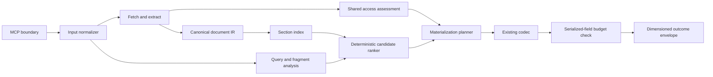

# RC.2 solution design

**Status:** Proposed
**Decision input:** [solution options](RC2_SOLUTION_OPTIONS.md)
**Scope:** RC.2 architecture; no RC.1 implementation is modified by this document.

## Design goals

RC.2 must make access, focus, completeness, and transport outcomes independently observable; preserve
native structured MCP inputs; and spend a caller's response budget only on returned data. The design is
deterministic, local-first, Native AOT compatible, and additive during the release-candidate migration.

Non-goals are a new MCP tool, an embedding service, a file cache, universal login-wall recognition,
global host deduplication, or a new public codec selector.

## Target flow



The materialization planner remains the semantic selection owner. Codecs serialize a materialized view;
they do not decide relevance or silently remove protected evidence.

## 1. MCP boundary and digest normalization

`occam_digest.urls` accepts either a JSON array of strings or the legacy string forms. A boundary
normalizer produces one canonical `IReadOnlyList<Uri>` and accumulates per-item validation issues.
Framework binding must not be allowed to emit an untyped transport error for a user-controlled shape.

Proposed schema concept:

```json
{
  "urls": {
    "oneOf": [
      { "type": "array", "items": { "type": "string" }, "minItems": 1 },
      { "type": "string", "minLength": 1 }
    ]
  }
}
```

If the current SDK cannot generate that contract from a union-friendly parameter, RC.2 should use an
explicit tool schema/handler adapter rather than publish a dishonest `string` schema. An SDK contract
spike is a prerequisite. Normalization has bounded item count and input length, preserves ordering, and
never logs full query strings or credentials.

## 2. Shared access assessment

Introduce one pure `AccessClassifier` used by probe and transcode. Inputs form an `AccessEvidence`
record, populated by fetch/worker adapters:

- HTTP status family and authentication challenge presence;
- redirect chain classification and final route shape;
- password input, identity form, submit target, blocking overlay, and usable-content evidence;
- extraction status and whether public content exists behind the UI;
- public-reference tier as a negative prior only.

Output:

```text
AccessAssessment
  disposition: open | login_likely | unknown
  confidence: 0..1
  stage: prefetch | dom | extracted | combined
  evidenceCodes: stable non-sensitive identifiers
  recommendedAction: continue | use_session | retry_or_inspect
```

A hard `requires_login` failure requires direct access-control evidence: an authentication status or
redirect, or a blocking identity UI with no usable public content. Authentication prose contributes no
positive weight. When DOM evidence is unavailable and status is inconclusive, the result is `unknown`;
transcode may retain usable content and attach a warning instead of manufacturing a hard failure.

Existing `HtmlProbeClassifier` and `LoginWallDetector` become evidence adapters or are retired after
parity tests. `RequiresLoginPostProcessor` consumes the shared assessment rather than reclassifying text.

## 3. Structure-aware focus planning

The canonical IR gains a compact `SectionIndex`:

```text
SectionEntry
  ordinal, level, heading, normalizedHeading
  anchorIds[]
  bodySpan
  blockKinds[]
  linkDensity
  isIndexLike
```

Workers should preserve source anchors when reliable; Core synthesizes normalized heading anchors as a
fallback. The fetched URL is fragment-free, while the original fragment is retained as query intent.

`FocusQueryAnalyzer` preserves quoted phrases and technical identifiers such as `401`, `1.2.3`,
`client_max_body_size`, and `Sec-Fetch-Mode`. It separates discriminating terms from common support
terms. The ranker combines:

- exact resolved anchor and exact/normalized heading match;
- phrase match and proximity in heading/body;
- coverage of discriminating terms;
- document-relative rarity (BM25/IDF-style, computed locally);
- answer-bearing body evidence and section depth;
- a strong TOC/index/link-density penalty.

The ranker returns scored candidates plus reason codes. Exact fragment matches have priority unless the
target is missing or index-like; unresolved fragments are reported. Multiple adjacent candidates may be
selected when a definition's list/table belongs to the next block.

`FocusAssessment` is `hit`, `weak`, or `miss`, with confidence, matched section/anchor, and diagnostics.
A lexical mention alone cannot yield `hit`.

## 4. Answer-preserving materialization and budget

Budgeting has two explicit inventories:

1. **Planning inventory:** all internal IR available for relevance and proof construction.
2. **Public inventory:** only fields selected for serialization by the requested projection.

`ResponseBudgetPlanner` allocates against the public inventory. Unrequested JSON blocks/tables cost zero
public tokens. Receipt costs include only the serialized receipt, never hidden evidence used to derive it.

The materialization planner selects an answer unit in priority order: matched heading, minimum explanatory
body, and tightly coupled list/table/code blocks. It then adds context while budget remains. Protected
body is trimmed only after lower-priority context, navigation, duplicate headings, and optional media.

When the minimum answer unit does not fit, the response stays within `max_tokens` and reports:

```text
completeness: incomplete
incompleteReason: focus_body_truncated | response_overhead | source_missing
suggestedMinTokens: estimated bounded value
```

The token estimator and final serialized-size check use the same projected field set. Any estimator
tolerance is explicit and measured; there is no silent budget expansion.

## 5. Outcome and diagnostics model

Common response/recovery dimensions are additive in RC.2:

- `transportOk`: the backend invocation completed;
- `usable`: the result passed extraction/router quality policy;
- `failureCode`: typed operational failure, when present;
- `escalationReason`: why another backend was attempted;
- `access`: the shared access assessment;
- `focus`: `hit`, `weak`, `miss`, or `not_requested`;
- `completeness`: `complete`, `partial`, or `incomplete`;
- `verdict`: semantic support/refute state where a tool actually computes one.

Confidence is scoped to its object (`access.confidence`, `focus.confidence`); a generic extraction
confidence cannot imply focus correctness. `claim_check.found` is migrated toward `retrieved`, with
`verdict: not_evaluated` unless a verifier performs semantic judgment.

Legacy fields remain aliases for one documented RC migration window and retain their old meanings.
Agent hints are derived from the dimensioned fields, not free-standing heuristics.

Diagnostics expose stable reason codes and aggregate counts. They must not include cookies, authorization
headers, password values, full sensitive URLs, or raw form contents. Debug traces are opt-in and redacted.

## 6. Lifecycle design

`launch-mcp-host.mjs` becomes an explicit parent/child state machine: forward termination and interrupt
signals, stop accepting restart work, wait a bounded interval for the exact child, then use the existing
targeted process-group cleanup. On Unix, an `exec`-style handoff is preferred for the release binary when
launcher work is no longer needed. The invalid assumption that parent-side `prctl` configures a child is
removed or replaced with a child-side mechanism.

Each host exposes a read-only instance descriptor through doctor/diagnostics: PID, parent PID, start time,
resolved `OCCAM_HOME`, binary path/version, transport, and optional owner label. Duplicate detection keys
on overlapping identity, not process name. Stop/refresh requires an exact instance identifier. Hermes
lifecycle hooks may wrap this interface if a stable API is confirmed; Occam remains host-agnostic.

## Compatibility, performance, and AOT

- The digest string form and old outcome aliases remain during RC.2; deprecation is documented.
- New records use concrete enums/records and source-generated JSON metadata; no reflection-only plugin
  loading or runtime model dependency is introduced.
- Section indexing is linear in document size. Candidate scoring uses bounded sections/terms and caches
  only per-call statistics. No file cache is added.
- DOM access signals are booleans/counts and normalized routes, not copied HTML, limiting memory and
  sensitive-data exposure.
- Existing backend and codec interfaces remain; adapters isolate migration.

## Failure modes and safe behavior

| Failure | Required behavior |
|---|---|
| SDK cannot express digest union | Do not ship a false schema; use explicit adapter or defer native arrays |
| DOM signals unavailable | Return `unknown`; do not infer a wall from prose |
| Fragment cannot resolve | Continue with query rank, report unresolved fragment |
| Rank confidence is weak | Return best bounded context with `focus=weak`, or typed miss per tool policy |
| Minimum answer unit cannot fit | Stay within budget and report `incomplete` with a suggestion |
| Final serialization exceeds budget | Deterministically trim optional fields, then fail typed if protected core cannot fit |
| Duplicate host detected | Diagnose only; never globally kill by name |

## Migration and rollback

Implementation is split into independently revertible PRs. Each behavior PR lands frozen regression tests
first, adds new fields before deprecating aliases, and keeps adapters until all callers use the shared
models. Rollback is a PR revert at the component seam; RC.2 should not add long-lived public environment
flags solely to mask architectural incompleteness.

Release acceptance is defined in [RC2_VALIDATION_PLAN.md](RC2_VALIDATION_PLAN.md). ADRs capture the
durable boundaries, while exact ranking weights and thresholds remain tested implementation policy.
